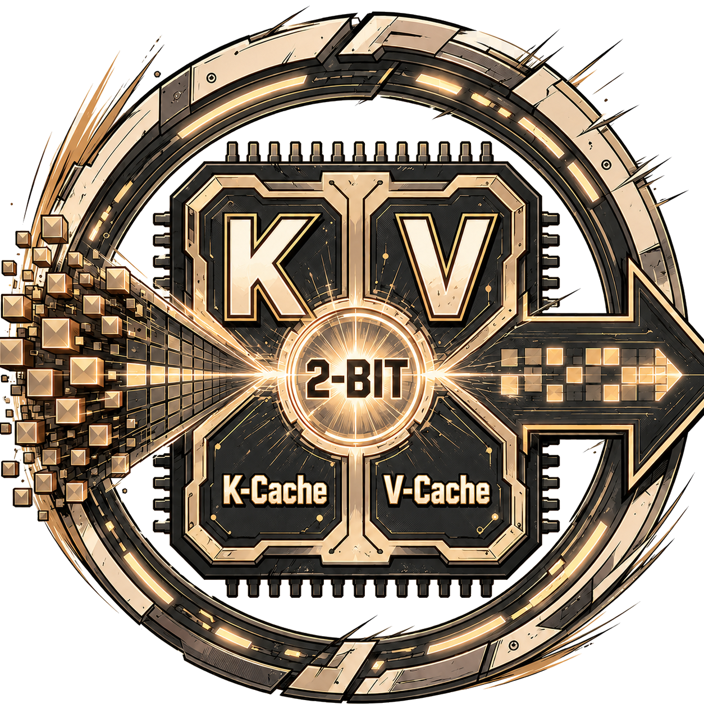
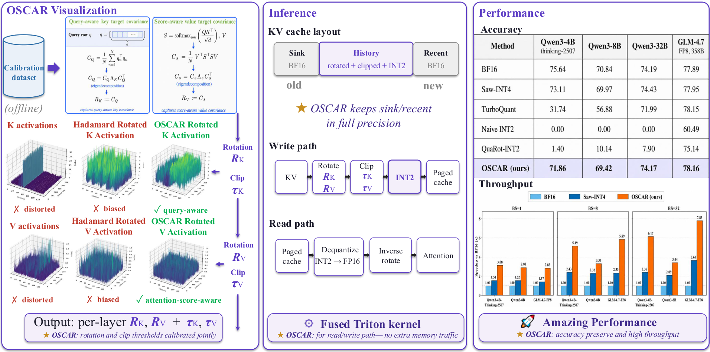
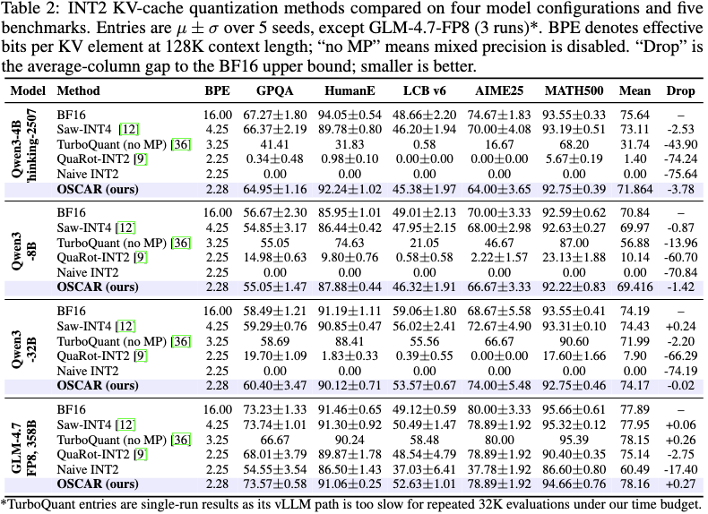

<p align="center">
  
</p>

# OSCAR

### Offline Spectral Covariance-Aware Rotation for 2-bit KV Cache Quantization

<p align="center">
  <a href="https://arxiv.org/pdf/2605.17757">
    
  </a>
  &nbsp;
  <a href="https://oscar-quantize.github.io/">
    
  </a>
  &nbsp;
  <a href="https://huggingface.co/Zhongzhu/OSCAR-RotationZoo">
    
  </a>
</p>

OSCAR captures Q/K/V activations on a small calibration set, estimates **attention-aware K/V covariance structures** offline, and derives per-layer rotations + clipping thresholds that align KV quantization with the directions attention actually consumes. The result is **INT2 storage for the bulk of the KV cache** plus a small BF16 sink + recent window — ~7× compression of the KV-cache memory footprint vs BF16, with single-digit pp accuracy drop on GPQA for the dense reasoning models we validated.

<p align="center">
  
</p>

OSCAR is built directly into the open-source SGLang framework: clone the repo,
set up the single environment, and run the dump, rotation, and evaluation
scripts end to end. It works out of the box, and we also provide a rotation zoo
so users can download calibrated rotations directly instead of recomputing them.

## Main results

> **Setup.** Each cell is the **MEAN across 5 reasoning / coding benchmarks**
> — **GPQA**, **HumanEval**, **LiveCodeBench v6**, **AIME 25**, **MATH-500**.
> To control single-seed variance, **every benchmark is evaluated 5 times
> per (model, method) cell** (3 times for GLM-4.7-FP8) and the per-seed
> scores are averaged before being averaged across benchmarks.
> TurboQuant rows are single-run (\*) because its vLLM path is too slow
> for repeated 32K-context evaluations under our compute budget. All runs
> use **32K-token max generation length**. **BPE** = effective bits per
> KV element at 128K context length. Higher is better; the BF16 row is
> the upper bound.

| Method | BPE | Qwen3-4B&nbsp;Thinking | Qwen3-8B | Qwen3-32B | GLM-4.7-FP8&nbsp;(358B) |
|:---|:---:|:---:|:---:|:---:|:---:|
| BF16 (upper bound) | 16.00 | 75.64 | 70.84 | 74.19 | 77.89 |
| Saw-INT4 | 4.25 | 73.11 | 69.97 | 74.43 | 77.95 |
| TurboQuant K3V3 \* | 3.25 | 31.74 | 56.88 | 71.99 | 78.15 |
| QuaRot-INT2 | 2.25 | 1.40 | 10.14 | 7.90 | 75.14 |
| Naive INT2 | 2.25 | 0.00 | 0.00 | 0.00 | 60.49 |
| **OSCAR (ours)** | **2.28** | **71.86** | **69.42** | **74.17** | **78.16** |
| _Gap of OSCAR vs BF16_ | | _−3.78_ | _−1.42_ | _−0.02_ | _+0.27_ |

<details>
<summary><b>Details for each task </b> </summary>

</details>

<details>
<summary><b>Baseline notes</b> — TurboQuant / QuaRot / Saw-INT4 / Naive INT2 configurations</summary>

For a fair comparison at a comparable bit-budget, **TurboQuant** results use
vLLM's implementation
([docs](https://docs.vllm.ai/en/latest/api/vllm/model_executor/layers/quantization/turboquant/))
modified so that **all layers are quantized** (no mixed precision); the
original TurboQuant keeps the first, last, and selected middle layers in
full precision. We run it in its **K3V3** configuration (3-bit K, 3-bit V)
to land near the OSCAR bit-budget.

**QuaRot-INT2** is the standard 2-bit KV-quant recipe (data-free Hadamard
rotation per layer). **Saw-INT4** is an INT4 reference for context.
**Naive INT2** is per-token symmetric INT2 with no rotation.

\* TurboQuant entries are single-run results because its vLLM path is too
slow for repeated 32K-context evaluations under our compute budget.

</details>

OSCAR is the only INT2 method that stays within a few pp of BF16 across
every model. QuaRot-INT2 and naive INT2 collapse on reasoning + coding
tasks. Saw-INT4 is a strong INT4 reference, but OSCAR matches or beats it
**at roughly half the storage** (≈2 bits per KV element).

## Layout

```
rotation/
  eval_oscar_gpqa.sh        generic GPQA eval driver
  eval_oscar_lcb.sh         generic LiveCodeBench v6 (128K) eval driver
  compute_kv_rotation.py    eigendecomposition + R·H·P_br composition
  _dump_compat/             sgl_kernel compat shim for dump
  <model>/
    save_qkv_<model>.sh     phase 1 — dump
    compute_rotation.sh     phase 2 — rotation
    eval_gpqa.sh            phase 3 — GPQA eval
    eval_lcb.sh             phase 3 — LCB v6 (128K) eval (where applicable)
    GPQA/
      seq<T>_prompt<N>_group<G>/
        qkv_dumps/          dump output
        rotations/          rotation .pt files
        _eval_gpqa_oscar/   eval results from this rotation
        _eval_lcb_v6_128k/  ...

sglang-research/            submodule — INT2 KV eval
sglang-dump-qkv/            vendored older sglang-fork — QKV dump (loaded via shim)
```

## Setup

### Requirements

- 1 × H100 80 GB (for 4B/8B), 4 × H100 (for 32B / MiniMax-M2.7), 8 × H100 (for GLM-4.7-FP8)
- CUDA 12.8 or 12.9 (nvcc on `$PATH`)
- Python 3.12 + Conda
- HuggingFace access for the relevant model weights

### Clone

```bash
git clone --recursive https://github.com/FutureMLS-Lab/OSCAR.git
cd OSCAR
```

### Conda env (single env, dump + eval)

OSCAR uses **one** conda env for both dump and eval. The dump-side sglang
(vendored as `sglang-dump-qkv/`) was originally built against an older
`sgl_kernel`; OSCAR ships a thin `rotation/_dump_compat/` shim that stubs
the dropped legacy symbols at import time and falls back to PyTorch for
the runtime sampling kernels it references, so a single eval-side env
suffices.

```bash
conda create -n oscar python=3.12 -y
conda activate oscar

# Eval-side sglang (editable so future patches stick)
pip install -e sglang-research/python

# CUDA-12.8/12.9 compatible flashinfer + sgl_kernel build
# (see https://github.com/sgl-project/sglang for matching wheels)
```

If `nvcc` and PyTorch's CUDA versions diverge (e.g. nvcc 12.6 but torch
built for 12.8), the JIT kernels in flashinfer may fail to compile. Pin
`CUDA_HOME` to the matching `cuda-12.x` directory before launching.

## Quick start (Qwen3-8B example)

End-to-end on a single H100, ~20 minutes total.

```bash
cd OSCAR

# Phase 1 — dump Q/K/V (TP=1, default DUMP_KVCACHE_TOKENS=30000)
bash rotation/qwen3-8B/save_qkv_8b.sh
# → writes rotation/qwen3-8B/GPQA/seq30000_prompt<N>_group128/qkv_dumps/

# Phase 2 — fit the calibrated rotation
bash rotation/qwen3-8B/compute_rotation.sh
# → writes rotation/qwen3-8B/GPQA/seq30000_prompt<N>_group128/rotations/{k,v}_rotation_qqt_r_h_pbr.pt

# Phase 3 — GPQA eval against the rotation we just produced
ROT_DIR=rotation/qwen3-8B/GPQA/seq30000_prompt<N>_group128/rotations \
  bash rotation/qwen3-8B/eval_gpqa.sh
# → writes results to rotation/qwen3-8B/GPQA/seq30000_prompt<N>_group128/_eval_gpqa_oscar/
```

Pick the actual `seq...prompt..._group...` tag printed by phase 1, or:

```bash
ROT_DIR=$(ls -1d rotation/qwen3-8B/GPQA/seq*_prompt*_group*/rotations | tail -1) \
  bash rotation/qwen3-8B/eval_gpqa.sh
```

## All configured models

| Folder | HF model | TP (dump) | TP (eval) | Notes |
|---|---|---|---|---|
| `rotation/qwen3-4B-thinking-2507/` | `Qwen/Qwen3-4B-Thinking-2507` | 1 | 1 | thinking model |
| `rotation/qwen3-8B/` | `Qwen/Qwen3-8B` | 1 | 1 | |
| `rotation/qwen3-32B/` | `Qwen/Qwen3-32B` | 2-4 | 4 | |
| `rotation/MiniMax-M2.7/` | `MiniMaxAI/MiniMax-M2.7` | 4 | 4 | FP8 weights, `--reasoning-parser minimax-append-think` |
| `rotation/GLM-4.7/` | `zai-org/GLM-4.7-FP8` | 8 | 8 | FP8 weights, 92 layers |

## How the rotation is fit (spectral covariance)

For each transformer layer, given calibration `(Q, K, V)` activations, OSCAR estimates two attention-aware **covariance** matrices and uses their eigenspectra to derive rotations:

- **K covariance** (`qqt`) — average attention-query covariance seen by K:
  `Σ_K = (1/H_kv) · Σ_h Q_h^T Q_h / n_tokens` (GQA-aware: query heads grouped under the matching KV head)
- **V covariance** (`sst`) — score-weighted V-side covariance:
  `Σ_V = (1/H_kv) · Σ_h V_h^T diag(w_h) V_h / n_tokens` where `w_h[t] = K_h[t] · (Q^T Q) · K_h[t]^T` is the per-token attention-score weight derived from K and the Q covariance
- `torch.linalg.eigh(Σ)` → orthogonal eigenvectors `R` plus the eigenvalues (used for ordering, not for scaling)
- Composition `r_h_pbr`: `R_loaded = R · H_d · P_br`
  - `H_d` — head-dim Hadamard
  - `P_br` — bit-reversal permutation, sorted by eigenvalue magnitude; this interleaves high-variance directions evenly across quant groups so no single group concentrates outliers

Saved as fp32 per-layer `(head_dim, head_dim)` orthogonal matrices in
`<calib_dir>/rotations/{k,v}_rotation_qqt_r_h_pbr.pt`.

## Serving with the rotation

The eval driver `eval_oscar_gpqa.sh` and `eval_oscar_lcb.sh` set everything for you. The underlying sglang server flags are:

```bash
SGLANG_ENABLE_MIXED_KV_WINDOWS=1 \
SGLANG_OSCAR_K_ROTATION_PATH=.../k_rotation_qqt_r_h_pbr.pt \
SGLANG_OSCAR_V_ROTATION_PATH=.../v_rotation_sst_r_h_pbr.pt \
SGLANG_OSCAR_K_CLIP_RATIO=0.96 \
SGLANG_OSCAR_V_CLIP_RATIO=0.92 \
SGLANG_OSCAR_ABSORB_V_ROTATION=1 \
SGLANG_MIXED_KV_PREFIX_TOKENS=64 \
SGLANG_MIXED_KV_RECENT_TOKENS=256 \
SGLANG_MIXED_KV_HP_MAX_SPLITS=8 \
SGLANG_MIXED_KV_HP_DTYPE=bfloat16 \
SGLANG_MIXED_KV_SCALE_DTYPE=float32 \
python -m sglang.launch_server \
  --model-path <model> \
  --tensor-parallel-size <tp> \
  --kv-cache-dtype int2 \
  --kv-cache-quant-group-size 128 \
  --prefill-attention-backend fa3 \
  --decode-attention-backend triton \
  --trust-remote-code
```

Sink (`PREFIX_TOKENS`) and recent window (`RECENT_TOKENS`) stay in BF16; the rest of the cache is INT2-quantized into 128-element groups along head-dim.

## Calibration knobs

Override per `bash rotation/<model>/save_qkv_<model>.sh ENV=val`:

| Env | Default | Effect |
|---|---|---|
| `DUMP_KVCACHE_TOKENS` | 30000 | Total token budget for calibration |
| `GROUP_SIZE` | 128 | KV quant group size, encoded in output dir name |
| `DATASET` | GPQA | Calibration dataset name |
| `MODEL` | per-model HF id | HuggingFace model id |
| `TP_SIZE` | per-model | Tensor parallel size for dump |
| `GPU` | per-model | CUDA_VISIBLE_DEVICES |
| `HF_HOME` | `/shared/huggingface` | HF cache (set to `$HOME/.cache/huggingface` on a fresh machine) |

## Citation

```bibtex
@misc{zhou2026oscarofflinespectralcovarianceaware,
      title={OSCAR: Offline Spectral Covariance-Aware Rotation for 2-bit KV Cache Quantization},
      author={Zhongzhu Zhou and Donglin Zhuang and Jisen Li and Ziyan Chen and Shuaiwen Leon Song and Ben Athiwaratkun and Xiaoxia Wu},
      year={2026},
      eprint={2605.17757},
      archivePrefix={arXiv},
      primaryClass={cs.LG},
      url={https://arxiv.org/abs/2605.17757},
}
```

## License & acknowledgements

- Released under the MIT License.
- Built on top of [sglang](https://github.com/sgl-project/sglang).
